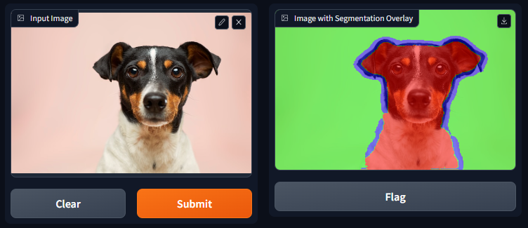

# Image Segmentation Web App
[](https://huggingface.co/spaces/soumyaprabhamaiti/image_segmentation_web_app)


This is a web app that segments the image of a pet animal into three regions - foreground (pet), background and boundary. It uses a [U-Net](https://arxiv.org/abs/1505.04597) model trained on [Oxford-IIIT Pet Dataset](https://www.robots.ox.ac.uk/~vgg/data/pets/) and is deployed using [Gradio](https://gradio.app/).

## Demo

The deployed version of this project can be accessed at [Hugging Face Spaces](https://huggingface.co/spaces/soumyaprabhamaiti/image_segmentation_web_app). Segmentation on a sample image is shown below:


## Installing Locally

To run this project locally, please follow these steps:

1. Clone the repository:

   ```
   git clone https://github.com/soumya-prabha-maiti/image-segmentation-web-app
   ```

2. Navigate to the project folder:

   ```
   cd image-segmentation-web-app
   ```

3. Install the required libraries:

   ```
   pip install -r requirements.txt
   ```

4. Run the application:

   ```
   python app.py
   ```

5. Access the application in your web browser at the specified port.

## Dataset

The [Oxford-IIIT Pet Dataset](https://www.robots.ox.ac.uk/~vgg/data/pets/) contains 37 categories of pets with roughly 200 images for each category. The images have a large variation in scale, pose and lighting. All images have an associated ground truth annotation of breed, head ROI, and pixel level trimap segmentation. Here the dataset was obtained using [TensorFlow Datasets](https://www.tensorflow.org/datasets/catalog/oxford_iiit_pet).

## Model Architecture

The segmentation model uses the UNET architecture. The basic architecture of the UNET model is shown below:

The UNET model consists of an encoder and a decoder. The encoder is a series of convolutional layers that extract features from the input image. The decoder is a series of transposed convolutional layers that upsample the features to the original image size. Skip connections are used to connect the encoder and decoder layers. The skip connections concatenate the feature maps from the encoder to the corresponding feature maps in the decoder. This helps the decoder to recover the spatial information lost during the encoding process.

The detailed architecture of the UNET model used in this project is shown below:
```
Model: "model"
__________________________________________________________________________________________________
 Layer (type)                   Output Shape         Param #     Connected to
==================================================================================================
 input_1 (InputLayer)           [(None, 256, 256, 3  0           []
                                )]

 conv2d (Conv2D)                (None, 256, 256, 16  448         ['input_1[0][0]']
                                )

 conv2d_1 (Conv2D)              (None, 256, 256, 16  2320        ['conv2d[0][0]']
                                )

 max_pooling2d (MaxPooling2D)   (None, 128, 128, 16  0           ['conv2d_1[0][0]']
                                )

 dropout (Dropout)              (None, 128, 128, 16  0           ['max_pooling2d[0][0]']
                                )

 conv2d_2 (Conv2D)              (None, 128, 128, 32  4640        ['dropout[0][0]']
                                )

 conv2d_3 (Conv2D)              (None, 128, 128, 32  9248        ['conv2d_2[0][0]']
                                )

 max_pooling2d_1 (MaxPooling2D)  (None, 64, 64, 32)  0           ['conv2d_3[0][0]']

 dropout_1 (Dropout)            (None, 64, 64, 32)   0           ['max_pooling2d_1[0][0]']

 conv2d_4 (Conv2D)              (None, 64, 64, 64)   18496       ['dropout_1[0][0]']

 conv2d_5 (Conv2D)              (None, 64, 64, 64)   36928       ['conv2d_4[0][0]']

 max_pooling2d_2 (MaxPooling2D)  (None, 32, 32, 64)  0           ['conv2d_5[0][0]']

 dropout_2 (Dropout)            (None, 32, 32, 64)   0           ['max_pooling2d_2[0][0]']

 conv2d_6 (Conv2D)              (None, 32, 32, 128)  73856       ['dropout_2[0][0]']

 conv2d_7 (Conv2D)              (None, 32, 32, 128)  147584      ['conv2d_6[0][0]']

 max_pooling2d_3 (MaxPooling2D)  (None, 16, 16, 128)  0          ['conv2d_7[0][0]']

 dropout_3 (Dropout)            (None, 16, 16, 128)  0           ['max_pooling2d_3[0][0]']

 conv2d_8 (Conv2D)              (None, 16, 16, 256)  295168      ['dropout_3[0][0]']

 conv2d_9 (Conv2D)              (None, 16, 16, 256)  590080      ['conv2d_8[0][0]']

 conv2d_transpose (Conv2DTransp  (None, 32, 32, 128)  295040     ['conv2d_9[0][0]']
 ose)

 concatenate (Concatenate)      (None, 32, 32, 256)  0           ['conv2d_transpose[0][0]',
                                                                  'conv2d_7[0][0]']

 dropout_4 (Dropout)            (None, 32, 32, 256)  0           ['concatenate[0][0]']

 conv2d_10 (Conv2D)             (None, 32, 32, 128)  295040      ['dropout_4[0][0]']

 conv2d_11 (Conv2D)             (None, 32, 32, 128)  147584      ['conv2d_10[0][0]']

 conv2d_transpose_1 (Conv2DTran  (None, 64, 64, 64)  73792       ['conv2d_11[0][0]']
 spose)

 concatenate_1 (Concatenate)    (None, 64, 64, 128)  0           ['conv2d_transpose_1[0][0]',
                                                                  'conv2d_5[0][0]']

 dropout_5 (Dropout)            (None, 64, 64, 128)  0           ['concatenate_1[0][0]']

 conv2d_12 (Conv2D)             (None, 64, 64, 64)   73792       ['dropout_5[0][0]']

 conv2d_13 (Conv2D)             (None, 64, 64, 64)   36928       ['conv2d_12[0][0]']

 conv2d_transpose_2 (Conv2DTran  (None, 128, 128, 32  18464      ['conv2d_13[0][0]']
 spose)                         )

 concatenate_2 (Concatenate)    (None, 128, 128, 64  0           ['conv2d_transpose_2[0][0]',
                                )                                 'conv2d_3[0][0]']

 dropout_6 (Dropout)            (None, 128, 128, 64  0           ['concatenate_2[0][0]']
                                )

 conv2d_14 (Conv2D)             (None, 128, 128, 32  18464       ['dropout_6[0][0]']
                                )

 conv2d_15 (Conv2D)             (None, 128, 128, 32  9248        ['conv2d_14[0][0]']
                                )

 conv2d_transpose_3 (Conv2DTran  (None, 256, 256, 16  4624       ['conv2d_15[0][0]']
 spose)                         )

 concatenate_3 (Concatenate)    (None, 256, 256, 32  0           ['conv2d_transpose_3[0][0]',
                                )                                 'conv2d_1[0][0]']

 dropout_7 (Dropout)            (None, 256, 256, 32  0           ['concatenate_3[0][0]']
                                )

 conv2d_16 (Conv2D)             (None, 256, 256, 16  4624        ['dropout_7[0][0]']
                                )

 conv2d_17 (Conv2D)             (None, 256, 256, 16  2320        ['conv2d_16[0][0]']
                                )

 conv2d_18 (Conv2D)             (None, 256, 256, 3)  51          ['conv2d_17[0][0]']

==================================================================================================
Total params: 2,158,739
Trainable params: 2,158,739
Non-trainable params: 0
```
## Libraries Used

The following libraries were used in this project:

- TensorFlow: To build segmentation model.
- Gradio: To create the user interface for the segmentation app.

## License

This project is licensed under the [MIT License](LICENSE).